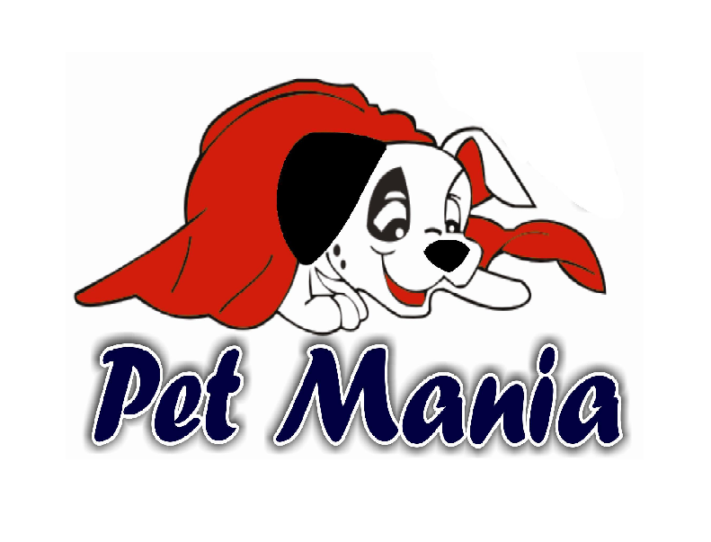

 

    

  <h3 align="center">Pet Mania</h3>

  

    Catálogo de produtos do Pet Mania onde o cliente pode se cadastrar e selecionar os produtos desejados para compras com maior comodidade.
     
    <a href="https://astounding-starburst-15d0f8.netlify.app/"><strong>Acessar demonstração »</strong></a>
  

  <h4 align="center"> 
    🚧  Projeto em desenvolvimento  🚧
  </h4>

# Autor
Yumi Kawano - yumikawano@outlook.com

https://www.linkedin.com/in/yumi-kawano/

# Licença

Este projeto esta sobe a licença MIT. Veja [LICENSE](https://github.com/yumikawano/projeto02/blob/main/LICENSE) para mais informações.